# FireRisk — User Guide

A step-by-step walkthrough of how to assess a property's wildfire risk with the
FireRisk app, from signing in to sharing a finished report. Every screenshot
below is taken from the app itself on a phone-sized screen — the app is designed
mobile-first for use out in the field.

> **What you'll accomplish:** create an account, walk a property through a
> 4-step assessment, read your risk report, explore the risk map and AR tools,
> and complete a few training lessons.

## Contents

1. [Getting started](#1-getting-started)
2. [The dashboard](#2-the-dashboard)
3. [Running an assessment](#3-running-an-assessment)
4. [Reading your report](#4-reading-your-report)
5. [The risk map](#5-the-risk-map)
6. [AR view](#6-ar-view)
7. [Training center](#7-training-center)
8. [Settings](#8-settings)
9. [Working offline](#9-working-offline)

---

## 1. Getting started

FireRisk is a Progressive Web App (PWA). Open it in your phone's browser and, if
prompted, choose **Add to Home Screen** / **Install** to run it full-screen like
a native app.

### Create an account

If you're new, tap **create a new account** on the sign-in screen and fill in
your name, email, and a password (at least 8 characters). You'll need to accept
the Terms of Service and Privacy Policy, then confirm your email before your
first sign-in.

| Sign in | Create account |
| --- | --- |
| 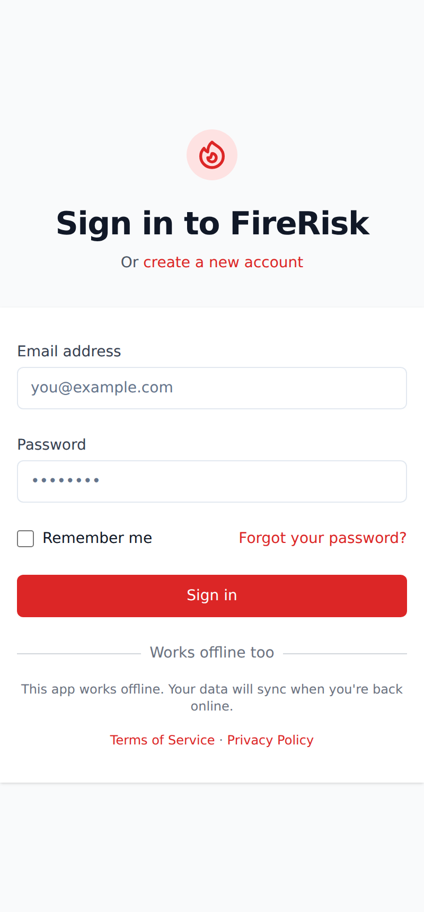 | 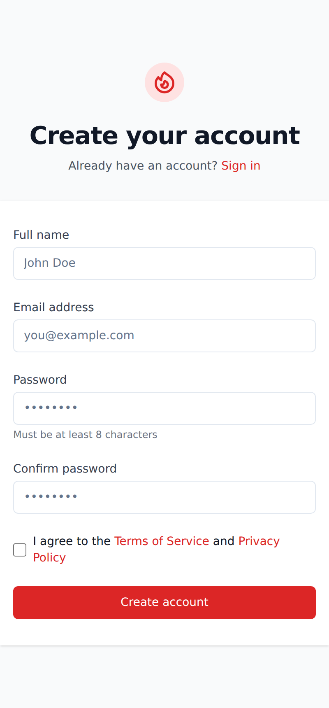 |

> **Works offline.** FireRisk keeps working with no signal — everything you
> capture is saved on your device and syncs automatically the next time you're
> online. See [Working offline](#9-working-offline).

---

## 2. The dashboard

After signing in you land on the **Dashboard** — your home base. At the top are
three quick actions (**New Assessment**, **View Risk Map**, **Training**),
followed by summary stats (total assessments, completed, average score, and how
many are in progress) and a list of your recent assessments.

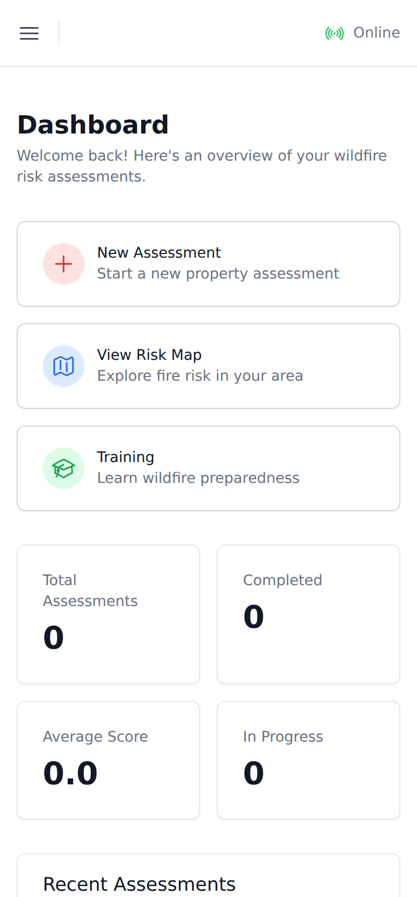

Tap the **☰ menu** in the top-left at any time to jump between Dashboard, New
Assessment, Risk Map, AR View, Training, and Settings.

---

## 3. Running an assessment

This is the core of the app. Tap **New Assessment** to start the 4-step wizard.
The progress bar at the top always shows where you are: **Property Info →
Photo Capture → Inspection → Results**. Use **Next** / **Previous** at the
bottom to move between steps.

### Step 1 — Property info

Enter the **property address** (required). Optionally add the Parcel ID/APN, and
tap **Use Current Location** to attach GPS coordinates. Your address is used to
pull local fire-risk data. When the address is filled, **Next** turns red and
becomes tappable.

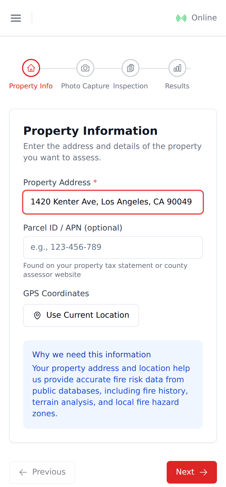

### Step 2 — Photo capture

Pick a category — **Defensible Space**, **Roof & Structure**, **Vegetation**, or
**Vents & Openings** — then tap **Take Photo** to capture that area of the
property. Each photo is analyzed on your device by the built-in AI, which flags
potential hazards automatically. A count badge shows how many photos you've
added per category.

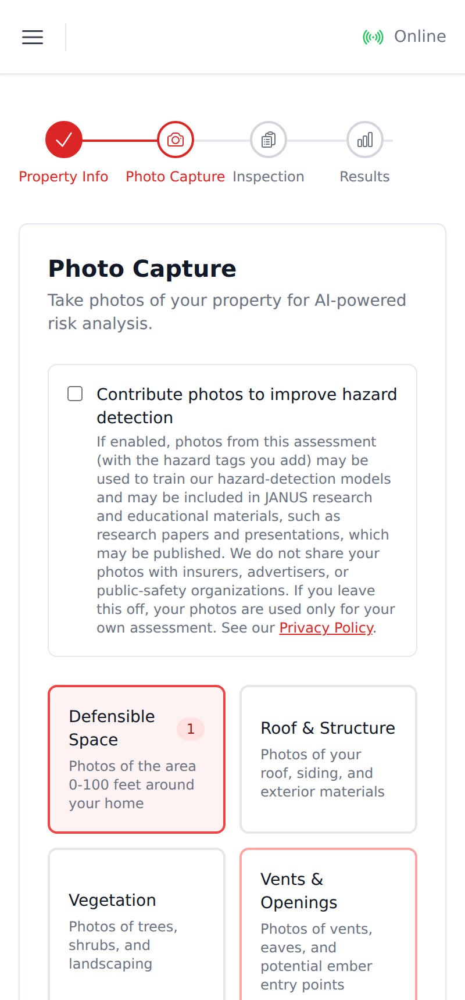

> **Optional:** tick **Contribute photos to improve hazard detection** if you'd
> like your photos to help train the models. Leave it off and your photos are
> used only for your own assessment. Read the disclosure carefully before opting
> in.

### Step 3 — Inspection checklist

Answer a series of **Yes / No** questions grouped by category (Defensible Space,
Roof & Structure, Vegetation, Ember Intrusion, Access & Evacuation, Water
Supply). Many questions cite the standard they're based on (e.g. *CAL FIRE PRC
4291*), and **More info** expands helpful guidance. The progress bar at the
bottom tracks how many you've answered.

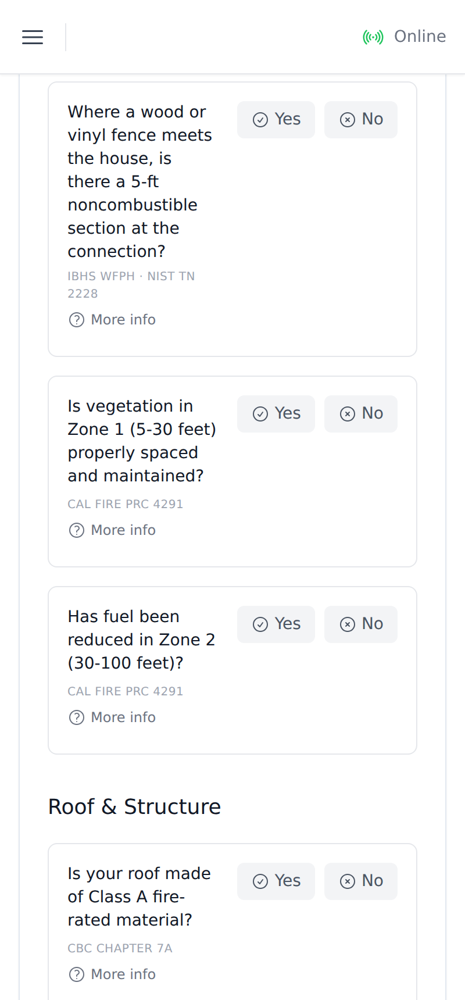

### Step 4 — Results

FireRisk computes an **Overall Risk Score** out of 10, a per-category breakdown,
key findings, and next steps.

> **Higher score = safer.** The score measures how prepared the property is, so
> a higher number means *lower* wildfire risk.

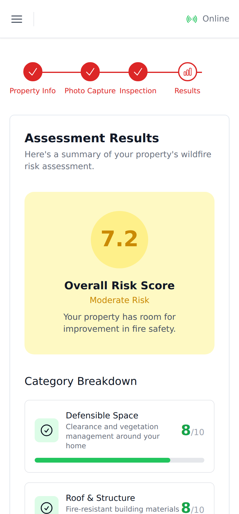

Review everything, then tap **Complete Assessment** to save it. It now appears on
your dashboard and in the property's history.

---

## 4. Reading your report

Opening a saved assessment shows the full report: the overall score with a risk
badge, each category's sub-score, and quick links to **View on Map** and
**AR View**. Below that are your **Findings** and, further down, prioritized
**Recommendations** — each tagged *immediate*, *short-term*, or *long-term* with
an estimated cost.

| Score & findings | Recommendations |
| --- | --- |
| 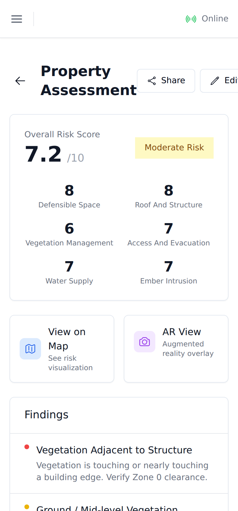 | 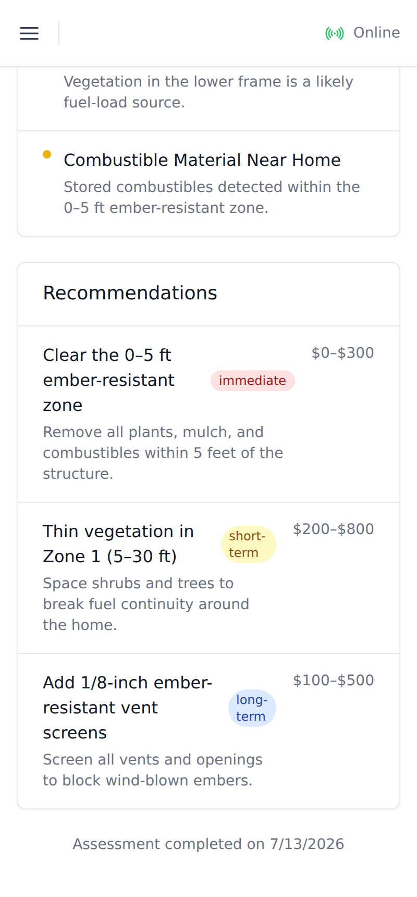 |

Use **Share** at the top of the report to generate a shareable link, email it to
a fire agency, or download a PDF.

---

## 5. The risk map

The **Risk Map** shows property risk in your area. Switch between **Satellite**,
**Street**, and **Terrain** base maps (top-left), toggle data **Layers** like
Fire History and Slope (top-right), and use the control stack (bottom-right) to
zoom, recenter, find your location, take a screenshot, or share the view.

To inspect a specific home, tap the **🔍 magnifier** to open **Select a
property**, then search an address or **Pick location on the map**.

| Select a property | Defensible-space zones |
| --- | --- |
| 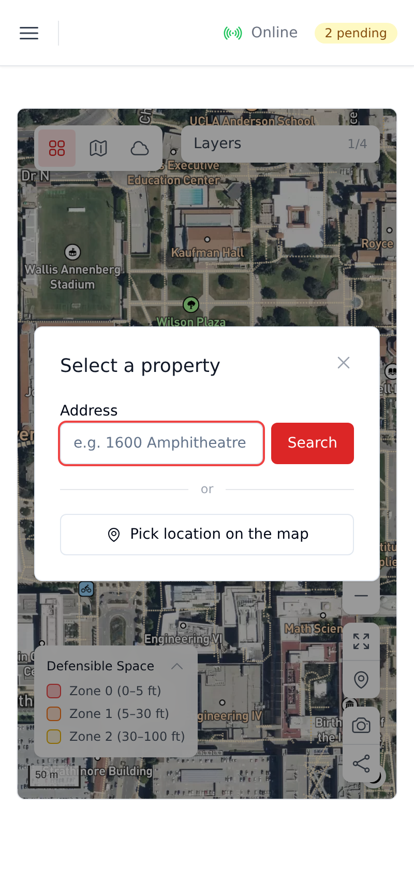 | 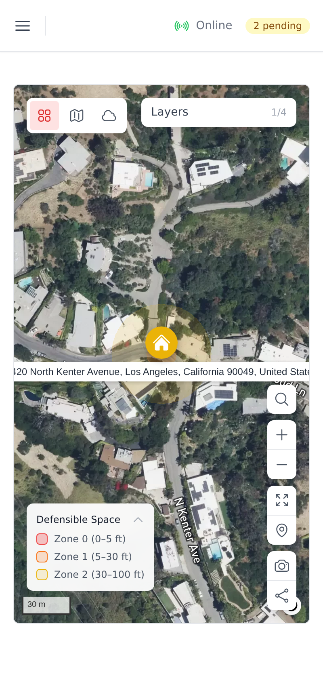 |

Once a property is focused, FireRisk draws the **defensible-space zones** around
it — **Zone 0** (0–5 ft), **Zone 1** (5–30 ft), and **Zone 2** (30–100 ft) — so
you can see the clearance areas at a glance. Where a building outline is
available the zones trace the footprint; otherwise they fall back to rings.

---

## 6. AR view

**AR View** overlays fire-risk information on your phone's live camera while you
walk the property. Use the mode selector (top-left) to switch between:

- **Camera Overlay (Live Scan)** — continuously scans the camera feed and marks
  detected hazards. Use the eye button to pause/resume scanning.
- **3D Model View** — shows the defensible-space zones anchored to the ground
  around your position.
- **Measurement** — tap two points to measure a distance in feet.

| Live scan | 3D defensible-space zones |
| --- | --- |
| 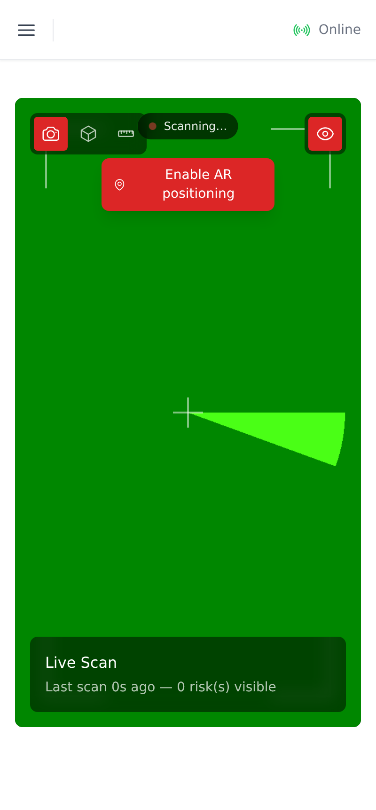 | 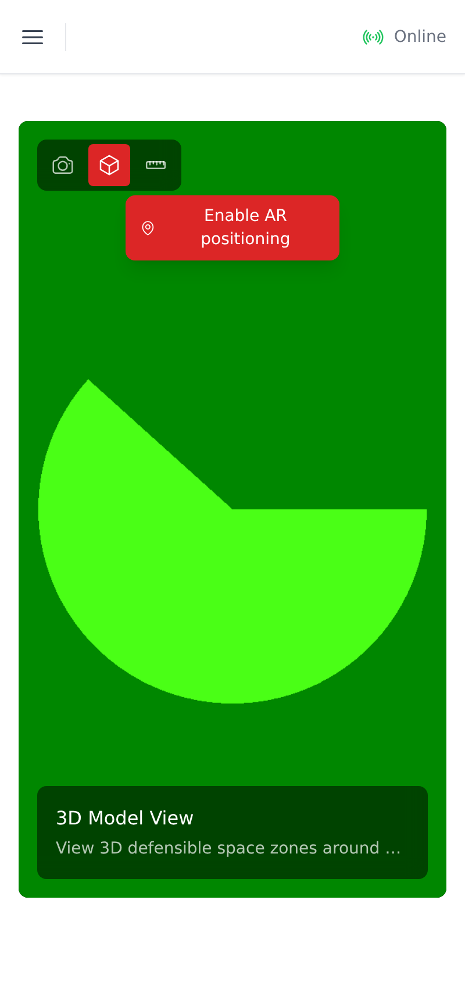 |

> AR needs camera access and works best outdoors. The green backgrounds above
> are a stand-in for the live camera feed in this documentation; on your device
> the overlays appear on top of the real camera view. (Full WebXR positioning is
> Android-only; iOS uses a compass-based overlay.)

---

## 7. Training center

The **Training Center** offers short courses on wildfire preparedness. Your
overall progress, lessons completed, and earned badges are shown at the top,
followed by the available courses.

| Course list | Inside a lesson |
| --- | --- |
| 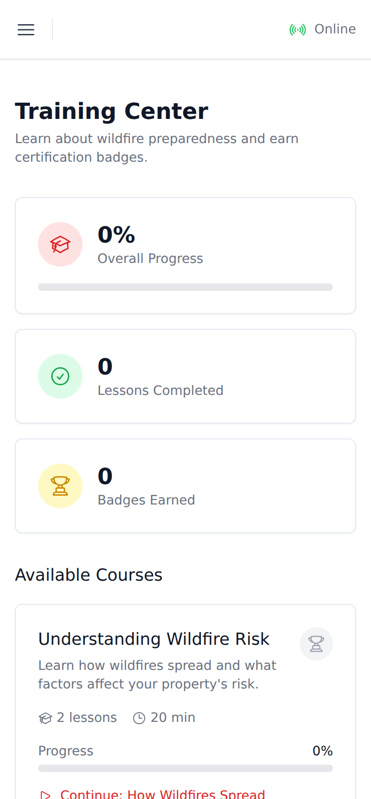 | 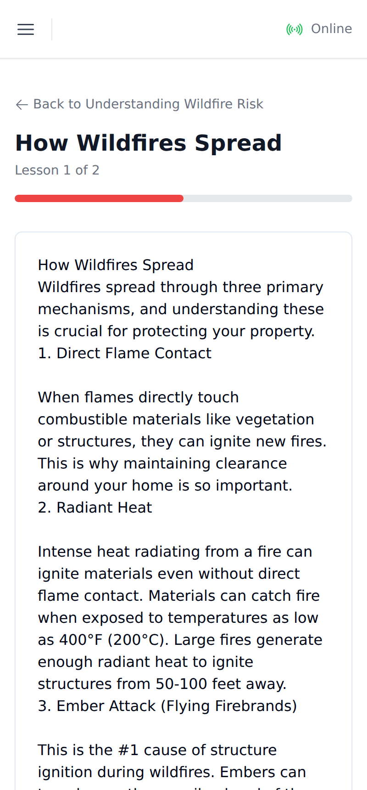 |

Open a course to read its lessons and take the end-of-lesson quiz. Passing a
quiz marks the lesson complete and moves you toward a certification badge.

---

## 8. Settings

In **Settings** you can update your profile, switch the theme between **Light**,
**Dark**, and **System**, toggle notifications, and manage your data — including
**Sync Now**, **Export my data**, and requesting data deletion. **Sign Out** is
at the bottom.

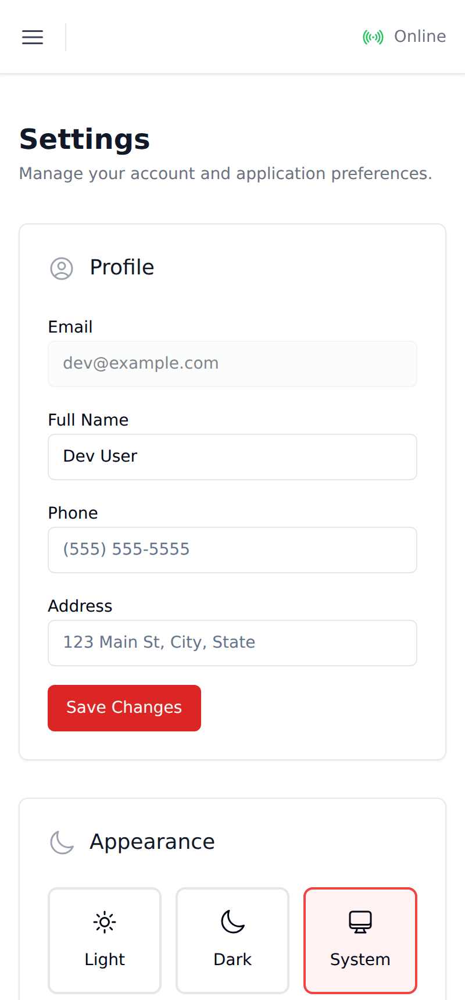

---

## 9. Working offline

FireRisk is built for the field, where signal is often poor:

- Everything you do — new assessments, photos, checklist answers, map
  annotations — is saved on your device immediately, even with no connection.
- The top bar shows an **Online / Offline** indicator and a **"N pending"** pill
  when you have changes waiting to upload.
- When you're back online, FireRisk syncs automatically. You can also force it
  from **Settings → Sync Now**.

So you can walk a property, complete a full assessment offline, and trust that it
will sync the moment you regain a connection.
