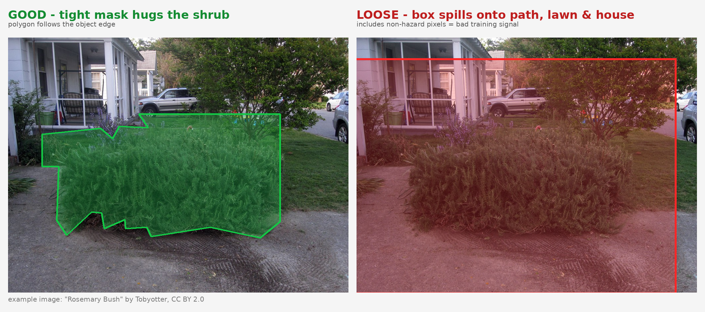

# CVAT Labeling Guide — Wildfire Hazard Instance Segmentation

**Audience:** data labeling team
**Task:** draw polygon masks around wildfire-hazard objects in residential property photos
**Output:** Ultralytics YOLO Segmentation labels used to train an on-device hazard detector

Read this whole page once before starting. Section 5 (class definitions) and
Section 6 (rules) are what you'll come back to.

---

## 1. What you're doing, in one paragraph

Each image shows a home and yard. Your job is to outline (with polygons) every
visible instance of the 11 hazard classes below, and assign each polygon the
correct class. One polygon = one physical object/area = one class. Some images
have many hazards; some have none (that's fine — submit them empty). The goal is
tight, accurate masks, not speed.

---

## 2. Project setup (lead does this once)

1. Open CVAT (self-hosted `http://localhost:8080`, or cvat.ai).
2. **Create a Project** named e.g. `wildfire-hazards`.
3. In the label editor, switch to **Raw** and paste the contents of
   **`cvat-labels.json`** (in this folder). **Do not add, rename, reorder, or
   delete labels** — the order encodes the model's class IDs. If a label is
   wrong, fix `cvat-labels.json` and re-paste; never hand-edit in the GUI.
4. **Create Tasks** under the project and upload the images from the `images/`
   folder. Split into tasks of ~100–200 images so jobs can be assigned and
   reviewed in parallel.
5. Enable the **Segment Anything (SAM)** AI tool (Settings → Models, or use
   cvat.ai where it's built in). This is what makes masking fast.

---

## 3. How to annotate one image (the efficient loop)

1. Open the image. Glance at the whole scene first.
2. For each hazard you see, use **AI Tools → Segment Anything**:
   - Click on the object → SAM proposes a mask.
   - Add positive clicks to grow it, shift/negative clicks to trim.
   - Accept when the mask hugs the object.
3. **Assign the correct class** to the mask (Section 5).
4. Repeat for every distinct hazard instance.
5. If SAM struggles (thin/wispy things like branches or gutter debris), switch to
   the **manual Polygon** tool and trace it.
6. Save the job frequently. Mark the frame complete when done.

Per-image "hint": when these images were collected, each was tagged with a
*suggested* class. Your lead may share these. **Treat hints as a nudge, not the
answer** — always scan for and label ALL hazards present, not just the hinted one.

---

## 4. What "good" looks like

*Left (GOOD): the polygon follows the foliage edge. Right (LOOSE): a box around
the object swallows sky, house wall, and lawn — those non-hazard pixels teach the
model the wrong thing. Always aim for the left.*

- **Tight masks.** The polygon edge should sit on the object's edge — not a loose
  box around it, not cutting into it. For SAM masks, trim spill-over onto sky,
  wall, or lawn.
- **One instance per object.** Two separate shrubs = two polygons. One continuous
  hedge = one polygon. A woodpile is one polygon even if it's many logs.
- **Label what's clearly identifiable.** If you can confidently tell what it is,
  label it. If you're squinting at a tiny blurry blob in the far background, skip
  it.
- **Occlusion:** mask only the visible part of a partially-hidden object. Do not
  guess the hidden extent.

---

## 5. The 11 classes (definitions + include / exclude)

Each polygon gets exactly one of these. Class IDs are fixed by `cvat-labels.json`.

| # | Class | Label it when you see… | Do NOT label |
|---|-------|------------------------|--------------|
| 0 | **dry-dead-vegetation** | Brown/cured/dead grass, dead shrubs, dried-out or brown plants — anything that reads as dry fuel | Healthy green lawn; bare soil; live green plants |
| 1 | **ground-fuels** | Loose leaf litter, pine-needle beds, bark, twig/slash/brush piles lying on the ground | Mulch beds (use #10); a tidy mowed lawn |
| 2 | **overhanging-vegetation** | Tree limbs/branches that are above, touching, or hanging over a roof, eave, or chimney | A tree standing in the yard not over any structure |
| 3 | **vegetation-near-structure** | Shrubs/plants/bushes growing directly against or within a few feet of a wall | A shrub in the middle of the yard far from the house |
| 4 | **woodpile-lumber** | Stacked firewood, cut logs, stored lumber/timber/pallets | A single fallen branch (that's ground-fuels); a standing tree |
| 5 | **propane-tank** | Cylindrical propane/LPG tanks or gas bottles | Water tanks; AC condensers; trash bins |
| 6 | **wood-shake-roof** | Wood shake / cedar-shingle roofing (the whole roof plane) | Asphalt-shingle, tile, or metal roofs |
| 7 | **roof-debris** | Leaves/needles/branches piled on a roof surface | A clean roof; debris on the ground |
| 8 | **gutter-debris** | Leaves/needles/moss filling a rain gutter channel | A clean gutter; downspouts |
| 9 | **combustible-fence** | Wood or vinyl fencing — prioritize the run nearest/attached to the house | Metal, chain-link, or masonry fences/walls |
| 10 | **combustible-mulch** | Bark / wood-chip / rubber mulch beds, especially within ~5 ft of a wall | Gravel, rock, or bare-soil beds |

**Roof material vs. roof debris (#6 vs #7):** #6 is the *roofing material itself*
being a hazard (wood shake). #7 is *stuff lying on top of* a roof of any material.
A wood-shake roof with leaves on it gets both: one polygon for the roof plane (#6)
and one for the leaf pile (#7).

---

## 6. Decision rules for tricky cases

**When two classes could apply to one object, label it once, by this priority:**

1. **Condition beats location for plants.** If vegetation is dry/dead → `dry-dead-vegetation` (#0), even if it's also near the structure or overhanging. Dryness is the bigger fuel signal.
2. If it's **green** but **overhanging a roof** → `overhanging-vegetation` (#2).
3. If it's **green** and **against a wall** (not overhanging) → `vegetation-near-structure` (#3).
4. **Mulch vs ground-fuels:** a deliberate bark/wood-chip *bed* → `combustible-mulch` (#10); loose natural leaf/needle litter → `ground-fuels` (#1).

**Empty images:** if there are no hazards (clean modern home, hardscaped yard,
or the photo is an interior / a close-up of a meter or document), **submit it with
zero annotations.** Empty examples are valuable — do not invent labels.

**Multiple properties in frame:** focus on the main/foreground property. You may
label clear hazards on it; ignore distant neighboring yards.

**When genuinely unsure** which class (or whether it's a hazard at all), leave it
unlabeled and flag the frame for your lead rather than guessing. Consistency
matters more than catching every marginal object.

---

## 7. People & privacy (PII)

These are real properties. If an image contains a **clearly visible face,
readable license plate, or readable house number**, do **not** label those —
and **flag the image to your lead** so it can be reviewed/removed or blurred.
Never annotate people; we have no "person" class.

---

## 8. Before you submit a job — self-check

- [ ] Every clearly-visible hazard in every frame is masked.
- [ ] Every mask has the right class (re-read the #6-vs-#7 and priority rules).
- [ ] Masks are tight — no big spill onto sky/wall/lawn, no cutting into objects.
- [ ] No "person" masks; PII frames flagged.
- [ ] Frames with nothing to label are marked complete (empty is OK).

---

## 9. Export (lead does this)

Export the project/task as **"Ultralytics YOLO Segmentation 1.0"**. The download
contains `data.yaml` + `labels/` in YOLO-seg polygon format. Hand this to the ML
owner — class order already matches `classes.txt` / `dataset.yaml` in this folder.

---

## 10. Quick reference

- 11 classes, IDs fixed by `cvat-labels.json` — never reorder.
- One polygon per object, one class per polygon, tight edges.
- Dry/dead plant → #0 regardless of location.
- Roof *material* = #6; *stuff on* roof = #7 (can co-occur).
- Mulch bed = #10; natural litter = #1.
- No hazards? Submit empty.
- Face / plate / house number visible? Flag it, don't label it.
